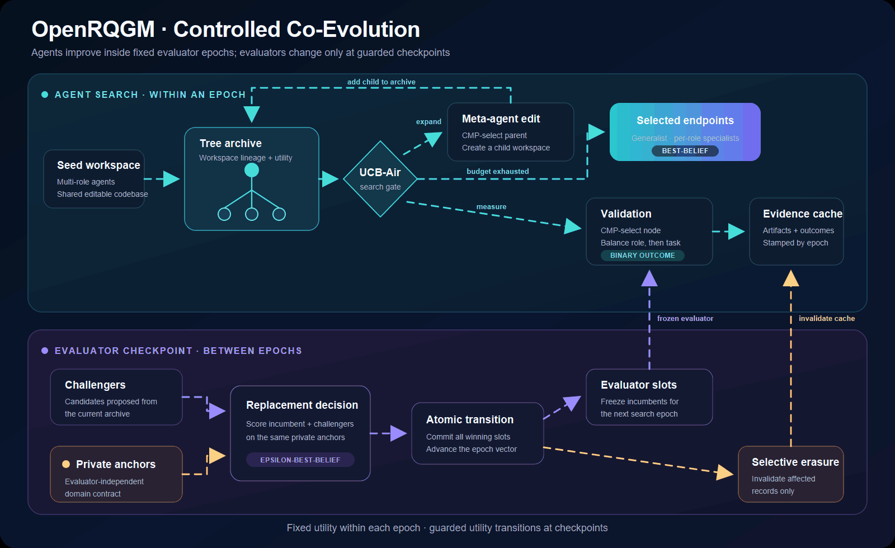

# OpenRQGM

[](https://github.com/DreamFallenFlowers/OpenRQGM/actions/workflows/ci.yml)
[](https://www.python.org/)
[](LICENSE)
[](https://arxiv.org/abs/2606.26294)

### Co-evolve AI agents and the evaluators that improve them.

OpenRQGM is an open, auditable, framework-independent implementation of the
core algorithm in *The Red Queen Gödel Machine: Co-Evolving Agents and Their
Evaluators*. It lets researchers evolve task-solving agents and learned
evaluators together, while domain-controlled private anchors gate evaluator
replacement to reduce drift and reward hacking.

This is an independent reproduction, not an official release by the paper
authors.

**[Quick start](#quick-start) · [How it works](#how-it-works) ·
[Public results](#public-reconstruction-results) ·
[Paper alignment](#paper-alignment) ·
[Codex skill](#codex-skill)**

## Public reconstruction results

The latest disclosed search uses GPT-5.5 low and a budget of 12,288 validation
outcomes. Its two saved endpoints were then scored in a separate fresh,
complete-suite held-out evaluation:

| Endpoint | Held-out score |
| --- | ---: |
| Coder specialist | **163 / 166 (98.19%)** |
| Generalist | **160 / 166 (96.39%)** |

The held-out re-evaluation used 96 additional model calls and 6,720,072 blended
tokens; those calls are not part of the 12,288-outcome search budget. These are
strong absolute results under the public reconstruction setting, and the saved
state passed the repository's structural invariant audit. They are **not an
apples-to-apples reproduction** of the paper's private experimental stack: the
authors' exact task identities, prompts, model endpoints, production harness,
and unpublished HGM code are unavailable. The repository therefore does not
claim that these numbers establish a direct improvement over the paper.

The repository currently commits a compact summary and artifact digest rather
than the raw run state, per-task outcomes, or model-call ledger, so the headline
scores are disclosed results rather than independently replayable evidence.

See the [full result and limitations](docs/results/paper-matched-v5-public-reconstruction.md)
and the [machine-readable summary](docs/results/paper-matched-v5-summary.json).

## Why OpenRQGM?

- **Agent–evaluator co-evolution.** Search includes both task-solving programs
  and learned evaluation cells instead of treating the evaluator as permanently
  fixed.
- **Drift-resistant replacement.** A domain-provided private-anchor contract
  decides whether an evaluator challenger replaces an incumbent independently
  of its training feedback.
- **Auditable search.** UCB-Air archive growth, clade-metaproductivity (CMP)
  Thompson sampling, validation scheduling, and state transitions are explicit
  and testable.
- **Safe evaluator transitions.** Replacement is atomic; selective erasure
  invalidates only measurements owned by the changed evaluator slots.
- **Framework-independent integration.** Domain logic lives behind small runtime
  interfaces, so OpenRQGM can orchestrate local models, API models, sandboxes,
  and custom benchmarks without owning them.

## Quick start

OpenRQGM requires Python 3.10 or newer. The built-in toy run is deterministic,
network-free, and does not require a model API key.

```bash
git clone https://github.com/DreamFallenFlowers/OpenRQGM.git
cd OpenRQGM

python -m venv .venv
# Linux/macOS: source .venv/bin/activate
# Windows PowerShell: .venv\Scripts\Activate.ps1

python -m pip install -e .
rqgm toy --output runs/toy
```

The command prints the selected endpoint, epsilon-best-belief value, evaluator
epoch vector, and archive size. It also writes:

- `runs/toy/summary.json` — compact endpoint and run summary;
- `runs/toy/state.json` — auditable archive, cached measurements, evaluator
  transitions, and selective-erasure state.

The core does not serialize examples returned by the anchor provider. Domain
adapters must still ensure that anchor material is not copied into workspaces,
candidate artifacts, caches, or training feedback that *is* persisted.

## How it works

RQGM maintains a tree archive of editable multi-role agent workspaces. Search
alternates between expanding that archive and measuring existing candidates.
At evaluator checkpoints, challengers are judged on private anchors; accepted
replacements advance the evaluator epoch and invalidate only affected cached
measurements.

<p align="center">
  
</p>

<p align="center"><a href="assets/openrqgm-architecture.svg">View static SVG</a></p>

The cyan loop grows and measures agent workspaces. The violet loop proposes and
selects learned evaluators, while the amber path represents the private-anchor
guardrail and selective erasure after a replacement.

The endpoint policy returns both a balanced generalist and the strongest
per-role specialists. See [Algorithm 1 correspondence](docs/algorithm-correspondence.md)
for the invariant-level mapping between the paper and the implementation.

## What can I use it for?

- co-evolving coding agents and test-generation evaluators;
- studying evaluator drift, specification gaming, and reward hacking;
- comparing fixed-evaluator search with learned-evaluator search;
- building auditable RSI and Gödel-machine toy experiments;
- adapting evaluator co-evolution to scientific or algorithmic optimization.

OpenRQGM supplies the orchestration, archive, scheduling, replacement, and
persistence semantics. A real domain supplies the workspace editor, task
evaluator, evaluator challenger source, anchor provider, and anchor evaluator.
That boundary is intentional: a generic library cannot manufacture a
trustworthy private anchor or safely sandbox arbitrary evolved code for every
domain.

## Python API

The following is a schematic integration outline; the adapter objects are
domain-specific. See the executable toy linked below for a complete example.

```python
from rqgm import RQGM, RQGMConfig, Runtime

engine = RQGM(
    seed_workspace=initial_workspace,
    tasks=tasks,
    slots=evaluator_slots,
    runtime=Runtime(
        editor=editor,
        task_evaluator=task_evaluator,
        challenger_source=challenger_source,
        anchor_provider=anchor_provider,
        anchor_evaluator=anchor_evaluator,
        training_feedback=training_feedback,
    ),
    config=RQGMConfig(validation_budget=1_024),
)

result = await engine.run()
print(result.endpoint)
print(result.specialists)
```

The concrete interfaces and a complete constructor are documented in the
[toy implementation](src/rqgm/toy.py). For a model-backed coding domain, start
with the [paper-coding example](examples/paper_coding/README.md).

## Paper alignment

| Component | Status |
| --- | --- |
| Published Algorithm 1 control flow | Implemented and tested |
| UCB-Air expansion and CMP archive selection | Implemented and tested |
| Role-first, task-second validation scheduling | Implemented and tested |
| Fixed and learned evaluation cells | Implemented and tested |
| Frozen evaluator slots and explicit epoch vector | Implemented and tested |
| Private-anchor challenger replacement | Implemented behind a domain interface |
| Atomic replacement and selective erasure | Implemented and tested |
| Balanced generalist and specialist endpoints | Implemented and tested |
| Authors' private prompts, datasets, and harness | Unavailable |
| Bit-for-bit reproduction of private experiments | Not claimed |

Read the [algorithm audit](docs/algorithm-correspondence.md),
[reproduction guide](docs/reproducibility.md), and
[experiment status](docs/paper-experiment-status.md) before comparing results.

## Repository layout

```text
src/rqgm/                 Core archive, scheduling, replacement, and persistence
tests/                    Algorithm invariants and regression tests
examples/paper_coding/    Model-backed coding-domain reconstruction
skills/rqgm-reproduction/ Reusable Codex workflow
docs/                     Algorithm audit, reproduction notes, and results
```

## Codex skill

The repository includes a reusable
[RQGM reproduction skill](skills/rqgm-reproduction/SKILL.md) for Codex. It can:

1. scaffold a domain adapter;
2. run or resume an experiment;
3. audit a run against the published Algorithm 1 invariants.

The skill wraps the library; it does not maintain a second implementation of
the algorithm. Private anchors, benchmark labels, credentials, and sensitive
model transcripts must not be placed in the skill or committed to the
repository.

## Development

```bash
python -m pip install -e ".[dev]"
ruff check .
ruff format --check .
pytest -q
rqgm toy --output runs/toy
python skills/rqgm-reproduction/scripts/audit_run.py runs/toy/state.json
```

See [CONTRIBUTING.md](CONTRIBUTING.md) for contribution and safety rules.

## Citation

If you use OpenRQGM, cite both the software and the original RQGM paper. The
repository includes a machine-readable [CITATION.cff](CITATION.cff).

```bibtex
@article{rqgm2026,
  title   = {The Red Queen G\"odel Machine: Co-Evolving Agents and Their Evaluators},
  year    = {2026},
  url     = {https://arxiv.org/abs/2606.26294}
}
```

## Scope and license

OpenRQGM is a reference implementation of the paper's published Algorithm 1
control flow. It is not a reconstruction of undisclosed prompts, datasets,
model endpoints, or infrastructure. The toy experiment validates mechanics,
not the paper's empirical claims.

Code is licensed under [Apache-2.0](LICENSE). Paper, benchmark, dataset, and
model licenses remain with their respective owners.
