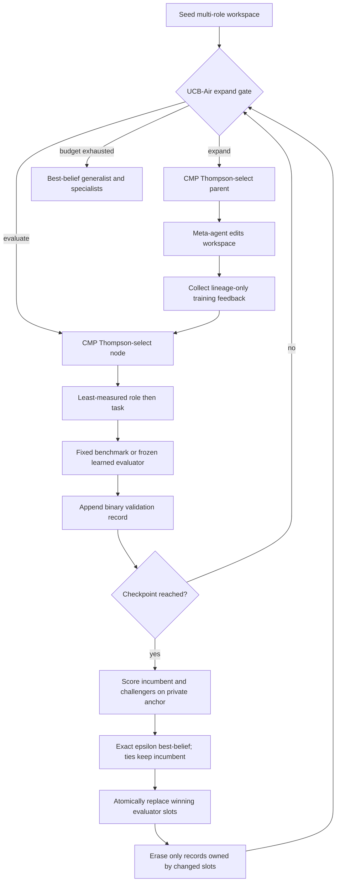

# RQGM Reference

An auditable, framework-independent implementation of the core algorithm in
*The Red Queen Gödel Machine: Co-Evolving Agents and Their Evaluators*
([arXiv:2606.26294](https://arxiv.org/abs/2606.26294)).

This repository implements the paper's full **Algorithm 1 control flow** and
keeps domain-specific agent calls behind explicit runtime interfaces. It is an
independent reproduction, not an official release by the paper authors.

## What is implemented

- a tree archive whose nodes are editable multi-role workspaces;
- UCB-Air archive growth and clade-metaproductivity (CMP) Thompson sampling;
- role-first, task-second least-measured validation scheduling;
- strict separation of training feedback from validation utility;
- fixed and learned evaluation cells in the same search;
- frozen evaluator slots and an explicit epoch vector;
- immutable, evaluator-independent anchor evaluation;
- exact Beta epsilon-best-belief replacement with incumbent-favoring ties;
- atomic multi-slot replacement and slot-local selective erasure;
- cached artifact reuse and lazy re-evaluation after transitions;
- balanced generalist and per-role specialist endpoints;
- JSON audit state that excludes private anchor examples;
- a network-free toy experiment and a reusable Codex skill.

The package implements the algorithmic orchestration. Real domains still have
to supply a workspace editor, task evaluator, evaluator challenger source,
anchor provider, and anchor evaluator. That boundary is intentional: no generic
library can provide a trustworthy private anchor or sandbox arbitrary evolved
code on behalf of every domain.

## Method overview



## Quick start

```bash
python -m venv .venv
# Windows: .venv\Scripts\activate
# POSIX: source .venv/bin/activate
python -m pip install -e ".[dev]"
pytest
rqgm toy --output runs/toy
```

The toy run is deterministic and requires no model or network access. Its
`state.json` records the archive, epochs, replacements and tombstoned utility
records while storing only anchor provider identity/version/fingerprint—not
anchor data.

## Python API

```python
from rqgm import RQGM, RQGMConfig, Runtime

engine = RQGM(
    seed_workspace=seed,
    tasks=role_tasks,
    slots=evaluator_slots,
    runtime=Runtime(
        editor=editor,
        task_evaluator=task_evaluator,
        challenger_source=challenger_source,
        anchor_provider=private_anchor_provider,
        anchor_evaluator=anchor_evaluator,
        training_feedback=training_feedback,
    ),
    config=RQGMConfig(validation_budget=128, checkpoint_start=32),
)
result = await engine.run()
```

Read [Algorithm correspondence](docs/algorithm-correspondence.md) before
claiming paper alignment, and [Reproducibility](docs/reproducibility.md) before
running a model-backed experiment.

## Codex skill

The repository includes [`skills/rqgm-reproduction`](skills/rqgm-reproduction),
which guides Codex through three concrete operations:

1. scaffold a domain adapter without leaking private anchors;
2. run and resume an RQGM experiment;
3. audit a run or implementation against the paper's invariants.

The skill is a workflow interface around this package, not a second algorithm
implementation.

## Scope and non-claims

This is a complete reference implementation of the *published Algorithm 1
control flow*. It is not a bit-for-bit reconstruction of the authors' private
experimental stack, prompts, datasets, model endpoints, or unpublished HGM
code. The included toy validates mechanics, not the paper's empirical claims.

## License

Apache-2.0. Paper, benchmark, dataset, and model licenses remain their owners'.
